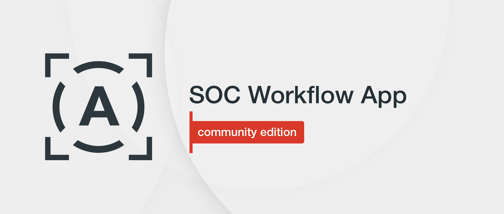
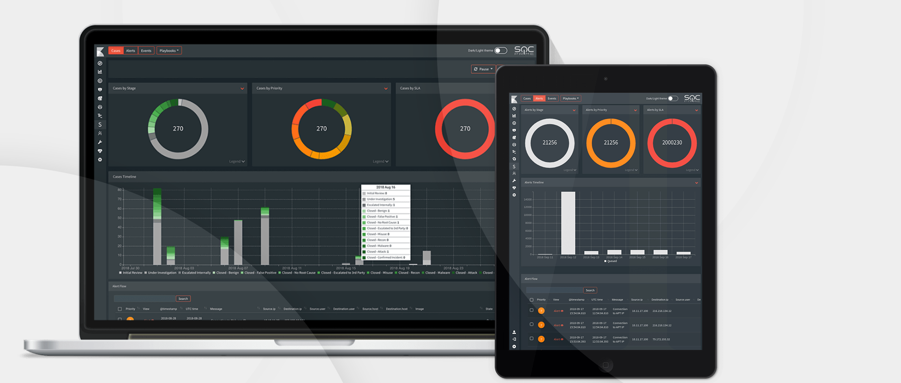

SOC Workflow App helps Security Analysts and Threat Hunters explore suspicious events, look into raw events arriving at Elastic stack and view Saved Searches saved by teammates. Carry out investigations based on automatically generated alerts from SIEM, EDR, IDS arriving at Elastic stack, Elastic Machine Learning alerts and Threat Intelligence data enrichments from Anomali ThreatStream & MISP.
# SOC Workflow Installation
To install SOC Workflow for your Kibana:
Copy the file soc_workflow_ce-xxxxx.zip to Kibana server and run the command:
```sh
/usr/share/kibana/bin/./kibana-plugin install file:///PATH_TO_FILE/soc_workflow_ce-xxxxx.zip
```


Wait until the installation finishes, it may take a few minutes to optimize and cache browser bundles. 
> If you get the error: "Plugin installation was unsuccessful due to error "Incorrect Kibana version in plugin [soc_workflow_ce]. Expected [6.2.4]; found [6.2.2]", please open zip archive and modify file
`"./kibana/soc_workflow_ce/package.json": `
put version of your Kibana to field "version".

Restart Kibana to apply the changes.
In case after restart Kibana you don't see any changes, go to /usr/share/kibana/optimize. Delete all files in the folder "optimize" including subfolders. And restart Kibana. This will make Kibana refresh its cache.

SOC Workflow Application is using indices: 

 - "alerts_ecs*" - for events that need to be investigated by SOC. That could be correlation events generated by logstash or scripts;
 - "alerts_logs*" - for workflow stages and comments history;
 - "case_ecs*" - is used to store cases;
 - "case_logs*" - for case stages and comments history;
 - "sigma_doc" - is used for storing SIGMA documents for data enrichment
 - "playbook" - for playbooks.

Create index templates for these indices from files:

 - [index_template_alerts_case_logs.txt](/resources/templates/index_template_alerts_case_logs.txt)
 - [index_template_case_ecs.txt](/resources/templates/index_template_case_ecs.txt)
 - [index_template_alerts_ecs.txt](/resources/templates/index_template_alerts_ecs.txt)
 - [index_template_playbook.txt](/resources/templates/index_template_playbook.txt)
 - [index_template_sigma_doc.txt](/resources/templates/index_template_sigma_doc.txt)

Add playbooks to the index from the application or add your own ones in the same format. Run commands in Dev Tools Kibana console from the file [`playbooks_to_elastic.txt`](/resources/templates/playbooks_to_elastic.txt).

Playbook format: 
`"@timestamp": "1530687175111",`
`"playbook_name" : "Playbook",`
`"playbook_body" : "PUT HERE TEXT OF YOUR PLAYBOOK IN HTML CONVERTED TO BASE64"`

Edit file 
```sh
/usr/share/kibana/plugins/soc_workflow_ce/config/playbook_alert_links.json
```
to add mapping of your own alerts to playbooks.
```sh
"Brute Force Detection Advanced": [
    "User Brute Force",
    "Server Brute Force Detection"
]
```
Where "Brute Force Detection Advanced" is the name of the playbook. 
"User Brute Force", "Server Brute Force Detection" - are alert names in the index alert-ecs*. For these alerts playbook "Brute Force Detection Advanced" will be automatically assigned in the SOC App.

Load SIGMA documents to index using Node.js plugin
See [elasticdump](https://www.npmjs.com/package/elasticdump)

Install it with command:
```sh
npm install elasticdump -g
```
To import SIGMA document use command:
```sh
elasticdump \
 --input=/path/to/file/sigma_doc_backup.json \
 --output=<elasticsearch protocol>://<elasticsearch host>:<elasticsearch port>/sigma_doc \
 --type=data
 ```
 Example:
 ```sh
elasticdump \
 --input=/path/to/file/sigma_doc_backup.json \
 --output=http://localhost:9200/sigma_doc \
 --type=data
```
Configure external commands to run scripts/commands and make lookups to the 3d parties services. 
Edit file `/usr/share/kibana/plugins/soc_workflow_ce/config/external_command.json`
 ```sh
 [{
    "Menu": [{
        "Submenu": [{
            "name": "Command 1",
            "command": "/bin/sh /opt/scripts/script1.sh \"[[value]]\""
        }]
    }]
},
{
    "name": "Command 2",
    "command": "/usr/bin/python2.7 /opt/scripts/scripts2.py -v \"[[value]]\""
},
{
    "name": "Command 3",
    "command": "/usr/bin/python2.7 /opt/scripts/script3.py -i [[value]]"
}]
  ```
  Where:
   - "name" - display name of the lookup command
   - "link" - link for drill-down.
   - Put [[value]] to the appropriate place in the link to send field value from the alert/case.
  
Copy predefined scripts for data enrichment and response from folder "scripts_app" to Kibana /opt/scripts. And run commands:
```sh  
chown -R kibana:kibana /opt/scripts
chmod +x /opt/scripts/*.sh
```
Now you can use the SOC Workflow plugin.

How to update
   - Backup all config files in folder `/usr/share/kibana/plugins/soc_workflow_ce/config/`.
   - Remove folder `/usr/share/kibana/plugins/soc_workflow_ce/`.
   - Install application from new version archive.
   - Remove Kibana cache - all files and subfolders in folder `/usr/share/kibana/optimize/`. Do not delete folder "optimize".
   - In needed update or add new templates for data.
   - Copy back upped configuration files to folder `/usr/share/kibana/plugins/soc_workflow_ce/config/`
   - Restart Kibana. Restart Kibana may take a while since rebuilding cache.

